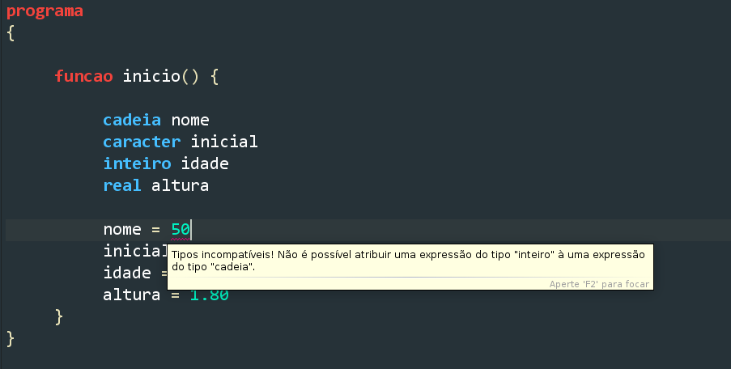
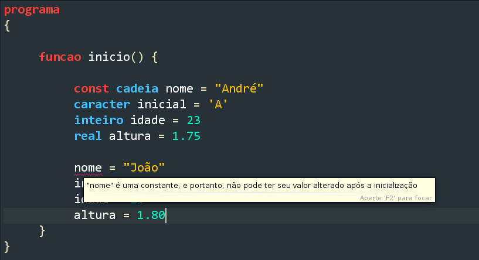

## Variáveis

<u> **Variáveis são usadas para armazenar valores em um programa**</u>.
É essencial entender como as variáveis funcionam para que passamos escrever programas mais complexos.

### Tipos de Variáveis

Os seguintes tipos básicos de variáveis são suportados em Portugol:

1. `inteiro`: Para números inteiros, como 10 ou -3
2. `real`: Para números reais (com casas decimais), como **3.14**
3. `logico`: Para valores lógicos, como **verdadeiro** ou **falso**
4. `caracter`: Para um único caractere, como 'a' ou 'Z'
5. `cadeia`: Para strings (sequências de caracteres), como "Olá, mundo!"

::: danger ATENÇÃO!!
`cadeia` não é utilizado para strings no **VisuAlg**, pois o tipo `caracter` também aceita sequências de caracteres.
:::

---

### Como Declarar Variáveis

Para declarar uma variável em Portugol, usamos a seguinte sintaxe:

::: code-group

```portugol [Portugol Studio]
tipo_da_variavel nome_da_variavel

// O tipo da variável vem antes do nome da variável.
// É possivel declarar variaveis conforme a necessidade.
```

```portugol [VisuAlg]
Var 
nome_da_variavel: tipo_da_variavel

// No VisuAlg, é necessário declarar as variáveis no campo "Var" antes de iniciar o algoritmo.
```

:::

Por exemplo, é assim que podemos declarar diferentes tipos de variáveis:

::: code-group

```portugol [Portugol Studio]
cadeia nome
caracter inicial 
inteiro idade
real altura
```

```portugol [VisuAlg]
Var 
nome: caracter
inicial: caracter
idade: inteiro
altura: real
```

:::

Neste exemplo, observamos as seguintes variáveis: `nome`, `inicial` `idade` e `altura`:

- `nome` que representa um cadeia de caracteres, usa o tipo `cadeia` no **Portugol Studio** e `caracter` no **VisuAlg**
- `inicial` é uma variável do tipo `caracter`
- `idade` é uma variável do tipo `inteiro`
- `altura` é uma variável do tipo `real`

---

### Atribuição de Valores

Para registrar valores em variáveis, atribuimos valores a elas. Veja como é feito com o exemplo das variáveis que declaramos anteriormente:

::: code-group

```portugol [Portugol Studio]
nome = "João"
inicial = 'J'
idade = 20
altura = 1.80
```

```portugol [VisuAlg]
nome <- "João"
inicial <- 'J'
idade <- 20
altura <- 1.80
```

:::

::: danger ATENÇÃO!!
Não respeitar os tipos declarados para as variáveis causará erros no programa. Por exemplo, se atribuirmos um valor do tipo `inteiro` a uma variável do tipo `cadeia`, o programa não será executado.
:::



---

### Constantes

Outra maneira de declarar variáveis é usando o modificador `const`. Isso é usado para declarar variáveis que não podem ser alteradas durante a execução do programa.

::: code-group

```portugol [Portugol Studio]
const cadeia nome = "André"
caracter inicial = 'A'
inteiro idade = 23
real altura = 1.75
```

```portugol [VisuAlg]
Const
nome = "André"
// O tipo da variável é inferido automaticamente.

Var
inicial: caracter
idade: inteiro
altura: real

inicio
    inicial <- 'A'
    idade <- 23
    altura <- 1.75
fimalgoritmo
```

:::

No exemplo acima, `nome` é uma constante, ou seja, se tentarmos alterar seu valor, o programa apresentará um erro.



---

### Declarações Múltiplas

Também é possível declarar várias variáveis do mesmo tipo em uma única linha! Veja como é feito no seguinte exemplo:

::: code-group

```portugol [Portugol Studio]
programa {
	funcao inicio() {
		inteiro idade, ano_nascimento, ano_atual

		idade = 17
		ano_nascimento = 2006
		ano_atual = idade + ano_nascimento
		escreva(ano_atual)
	}
}
```

```portugol [VisuAlg]
algoritmo "Declarações Múltiplas"
Var
idade, ano_nascimento, ano_atual: inteiro
inicio
    idade <- 17
    ano_nascimento <- 2006
    ano_atual <- idade + ano_nascimento
    escreval(ano_atual)
fimalgoritmo
```

:::

---

### Exemplo de Uso de Variáveis

Vejamos como podemos usar esses diferentes tipos de variáveis para escrever um programa que calcula a área de um círculo:

::: code-group

```portugol [Portugol Studio]
programa {
    const real PI = 3.14
    funcao inicio() {
        inteiro raio = 5
        real area 
        area = PI * raio * raio
        escreva(area)
    }
}
```

```portugol [VisuAlg]
algoritmo "Área do Círculo"
Const
PI = 3.14
Var
raio: inteiro
area: real
inicio
    raio <- 5
    area <- PI * raio * raio
    escreval(area)
fimalgoritmo
```

:::

::: tip Dica

É boa prática registrar valores que nunca mudam (**como o valor de PI**) como constantes, para evitar que sejam alterados acidentalmente.

:::

Com isso, aprendemos como declarar variáveis e constantes em Portugol. A seguir vamos estudar como usá-las em expressões de decisão!
