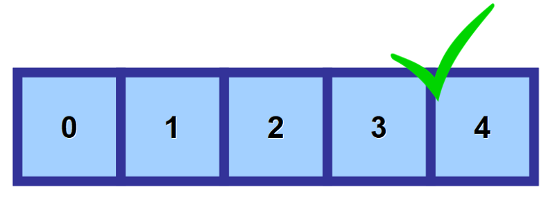
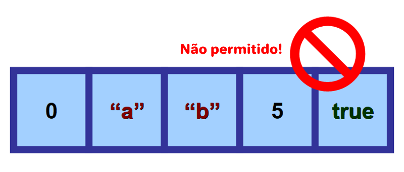

## Vetores

Vetores (ou array uni-dimensional) são estruturas de dados que permitem **armazenar uma coleção de valores do mesmo tipo**.
Cada valor no vetor é identificado por um índice, com esse podemos acessar ou alterar o valor armazenado.

Os vetores são declarados da seguinte forma:

::: code-group

```portugol [Portugol Studio]
inteiro numeros[5]
```

```portugol [VisuAlg]
var
    numeros: vetor[1..5] de inteiro
```

:::

O exemplo acima declara um vetor chamado `numeros` que pode armazenar até 5 valores do tipo inteiro.
Visualmente, podemos representar o vetor da seguinte forma:


<FonteImg
:src="`https://www.freecodecamp.org/news/data-structures-101-arrays-a-visual-introduction-for-beginners-7f013bcc355a/`"
:por="'Estefania Cassingena'"
:em="'freeCodeCamp'"
/>

Como ilustrado acima, a variável `numeros` está associada a 5 espaços vazios, que podem ser preenchidos com valores do tipo inteiro.

### Como utilizar um vetor?

Para armazenar ou ler um valor em vetores, utilizamos o nome da variável seguido de colchetes contendo o `índice` do valor que queremos acessar. Veja o exemplo abaixo:

::: code-group

```portugol [Portugol Studio]
inteiro numeros[5]

numeros[0] = 1
numeros[1] = 2
numeros[2] = 3
numeros[3] = 4
numeros[4] = 5

para(inteiro i = 0; i < 5; i++) {
    escreva(numeros[i])
}
```

```portugol [VisuAlg]
var
    numeros: vetor[1..5] de inteiro
    i: inteiro
inicio
    numeros[1] <- 1
    numeros[2] <- 2
    numeros[3] <- 3
    numeros[4] <- 4
    numeros[5] <- 5

    para i de 1 ate 5 faca
        escreva(numeros[i])
    fimpara
fimalgoritmo
```

:::

:::tip IMPORTANTE
Na programação é comum que o primeiro índice de um vetor seja o 0, e não o 1. Isso é conhecido como `numeração baseada em zero`.
[Leia mais a respeito](https://www.tabnews.com.br/Diletante/porque-o-indice-de-arrays-tuplas-e-vetores-sao-baseados-em-zero-em-algumas-linguagens).
:::

É importante ressaltar que o tipo de dado declarado para o vetor deve ser seguido a risca,
**tentar armazenar um valor de tipo diferente no vetor resultará em um erro**.





<FonteImg
:src="`https://www.freecodecamp.org/news/data-structures-101-arrays-a-visual-introduction-for-beginners-7f013bcc355a/`"
:por="'Estefania Cassingena'"
:em="'freeCodeCamp'"
/>

---

Uma vez que o vetor foi declarado, não é possível alterar o seu tamanho.
O vetor `numeros` foi declarado para armazenar até 5 valores, mas se precisarmos armazenar 10 valores,
teremos que declarar um novo vetor com o tamanho adequado.

::: code-group

```portugol [Portugol Studio]
inteiro numeros[5]

numeros[0] = 1
numeros[1] = 2
numeros[2] = 3
numeros[3] = 4
numeros[4] = 5

inteiro maisNumeros[10]

para(inteiro i = 0; i < 5; i++) {
    maisNumeros[i] = numeros[i]
}

para(inteiro i = 5; i < 10; i++) {
    maisNumeros[i] = i + 1
}
```

```portugol [VisuAlg]
var
    numeros: vetor[1..5] de inteiro
    maisNumeros: vetor[1..10] de inteiro
    i: inteiro
inicio

    numeros[1] <- 1
    numeros[2] <- 2
    numeros[3] <- 3
    numeros[4] <- 4
    numeros[5] <- 5

    para i de 1 ate 5 faca
        maisNumeros[i] <- numeros[i]
    fimpara

    para i de 6 ate 10 faca
        maisNumeros[i] <- i
    fimpara
fimalgoritmo
```

:::

O exemplo acima copia os valores do vetor `numeros` para o segundo vetor `maisNumeros`, e em seguida,
preenche os espaços restantes de `maisNumeros` com os valores de 6 a 10.

## Matrizes

(pendente)
