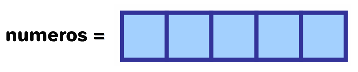

## Vetores

Vetores (ou array uni-dimensional) são estruturas de dados que permitem **armazenar uma coleção de valores do mesmo tipo**.
Cada valor no vetor é identificado por um índice, com esse podemos acessar ou alterar o valor armazenado.

Os vetores são declarados da seguinte forma:

::: code-group

```portugol [Portugol Studio]
inteiro numeros[5]
```

```portugol [VisuAlg]
var
    numeros: vetor[1..5] de inteiro
```

:::

O exemplo acima declara um vetor chamado `numeros` que pode armazenar até 5 valores do tipo inteiro.
Visualmente, podemos representar o vetor da seguinte forma:



<FonteImg
:src="`https://www.freecodecamp.org/news/data-structures-101-arrays-a-visual-introduction-for-beginners-7f013bcc355a/`"
:por="'Estefania Cassingena'"
:em="'freeCodeCamp'"
/>

Como ilustrado acima, a variável `numeros` está associada a 5 espaços vazios, que podem ser preenchidos com valores do tipo inteiro.

### Como utilizar um vetor?

Para armazenar ou ler um valor em vetores, utilizamos o nome da variável seguido de colchetes contendo o `índice` do valor que queremos acessar. Veja o exemplo abaixo:

::: code-group

```portugol [Portugol Studio]
inteiro numeros[5]

numeros[0] = 1
numeros[1] = 2
numeros[2] = 3
numeros[3] = 4
numeros[4] = 5

para(inteiro i = 0; i < 5; i++) {
    escreva(numeros[i])
}
```

```portugol [VisuAlg]
var
    numeros: vetor[1..5] de inteiro
    i: inteiro
inicio
    numeros[1] <- 1
    numeros[2] <- 2
    numeros[3] <- 3
    numeros[4] <- 4
    numeros[5] <- 5

    para i de 1 ate 5 faca
        escreva(numeros[i])
    fimpara
fimalgoritmo
```

:::

:::warning IMPORTANTE
Na programação é comum que o primeiro índice de um vetor seja o 0, e não o 1. Isso é conhecido como `numeração baseada em zero`.
[Leia mais a respeito](https://www.tabnews.com.br/Diletante/porque-o-indice-de-arrays-tuplas-e-vetores-sao-baseados-em-zero-em-algumas-linguagens).
:::

É importante ressaltar que o tipo de dado declarado para o vetor deve ser seguido a risca,
**tentar armazenar um valor de tipo diferente no vetor resultará em um erro**.


<FonteImg
:src="`https://www.freecodecamp.org/news/data-structures-101-arrays-a-visual-introduction-for-beginners-7f013bcc355a/`"
:por="'Estefania Cassingena'"
:em="'freeCodeCamp'"
/>

---

Uma vez que o vetor foi declarado, não é possível alterar o seu tamanho.
O vetor `numeros` foi declarado para armazenar até 5 valores, mas se precisarmos armazenar 10 valores,
teremos que declarar um novo vetor com o tamanho adequado.

::: code-group

```portugol [Portugol Studio]
inteiro numeros[5]

numeros[0] = 1
numeros[1] = 2
numeros[2] = 3
numeros[3] = 4
numeros[4] = 5

inteiro maisNumeros[10]

para(inteiro i = 0; i < 5; i++) {
    maisNumeros[i] = numeros[i]
}

para(inteiro i = 5; i < 10; i++) {
    maisNumeros[i] = i + 1
}
```

```portugol [VisuAlg]
var
    numeros: vetor[1..5] de inteiro
    maisNumeros: vetor[1..10] de inteiro
    i: inteiro
inicio

    numeros[1] <- 1
    numeros[2] <- 2
    numeros[3] <- 3
    numeros[4] <- 4
    numeros[5] <- 5

    para i de 1 ate 5 faca
        maisNumeros[i] <- numeros[i]
    fimpara

    para i de 6 ate 10 faca
        maisNumeros[i] <- i
    fimpara
fimalgoritmo
```

:::

O exemplo acima copia os valores do vetor `numeros` para o segundo vetor `maisNumeros`, e em seguida,
preenche os espaços restantes de `maisNumeros` com os valores de 6 a 10.

## Matrizes

Matrizes, também conhecidas como arrays multidimensionais, são uma importante estrutura de dados na programação.
Elas são, essencialmente, um vetor de vetores.
Isso significa que uma matriz pode ser vista como uma tabela, onde cada linha da tabela é um vetor.


<FonteImg
:src="`https://dicasdeprogramacao.com.br/o-que-sao-vetores-e-matrizes-arrays/`"
:por="'Gustavo Furtado'"
:em="'dicasdeprogramacao.com.br'"
/>

A matriz acima pode ser declarada da seguinte forma:

::: code-group

```portugol [Portugol Studio]
real notas[50][4]
```

```portugol [VisuAlg]
var
    notas: vetor[1..50, 1..4] de real
```

:::

Como ilustrado acima, a matriz de notas é composta por 50 linhas e 4 colunas,
e cada posição (x, y) da matriz pode armazenar a nota de um aluno.

### Como utilizar uma matriz?

Veja um exemplo de como avaliar a aprovação de um aluno com base na sua média:

::: code-group

```portugol [Portugol Studio]
real notas[5][4]
real media

para(inteiro i = 0; i < 5; i++) {
    escreva("Digite as notas do aluno ", i + 1, "\n")
    para(inteiro j = 0; j < 4; j++) {
        escreva("Nota ", j + 1, ": ")
        leia(notas[i][j])
    }
}

para(inteiro i = 0; i < 5; i++) {
    media = 0.0
    para(inteiro j = 0; j < 4; j++) {
        media = media + notas[i][j]
    }
    media = media / 4

    se(media >= 6) {
        escreva("Aluno ", i + 1, " aprovado!\n")
    } senao {
        escreva("Aluno ", i + 1, " reprovado!\n")
    }
}
```

```portugol [VisuAlg]
var
    notas: vetor[1..5, 1..4] de real
    media: real
    i, j: inteiro
inicio
    para i de 1 ate 5 faca
        escreva("Digite as notas do aluno ", i, "\n")
        para j de 1 ate 4 faca
            escreva("Nota ", j, ": ")
            leia(notas[i, j])
        fimpara
    fimpara

    para i de 1 ate 5 faca
        media <- 0.0
        para j de 1 ate 4 faca
            media <- media + notas[i, j]
        fimpara
        media <- media / 4

        se(media >= 6) entao
            escreva("Aluno ", i, " aprovado!")
        senao
            escreva("Aluno ", i, " reprovado!")
        fimse
    fimpara
fimalgoritmo
```

:::

:::warning IMPORTANTE
Observe que nas matrizes é necessário dois laços de repetição
aninhados para percorrer todos os valores da matriz. Isso porque um loop é necessário para percorrer as linhas, e outro para percorrer as colunas.
:::

## Vídeo Aula

Se restou alguma dúvida, assista a vídeo aula abaixo:

<Youtube id="ergCGg9r2DY"/>

<style scoped lang="scss" >

.vp-doc p:has(> img) {
    display: flex;
    justify-content: center;
}

</style>
